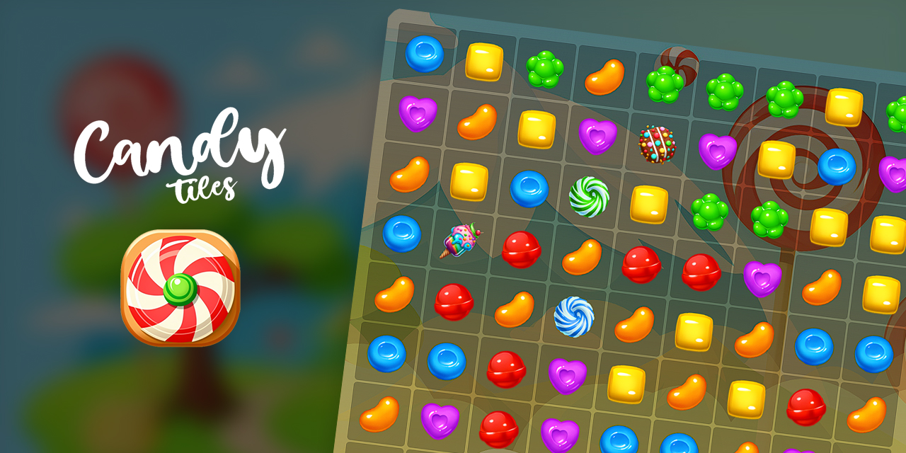
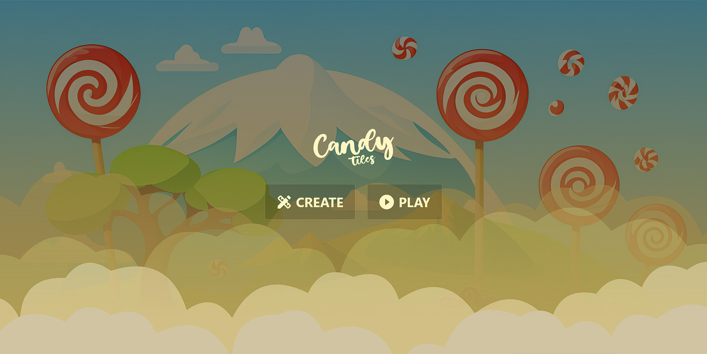
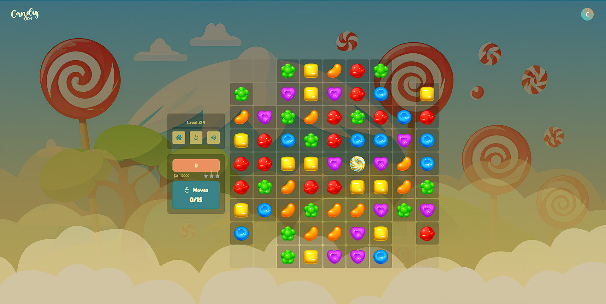
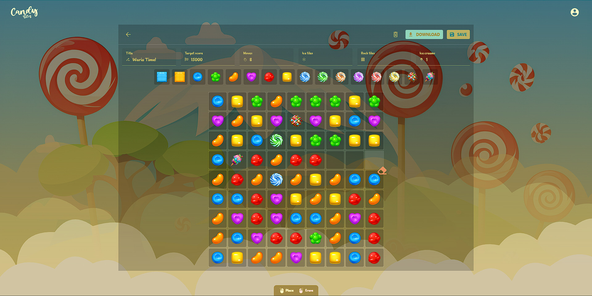

<h1 align="center">
 🍭 Candy Tiles
</h1>

<h5 align="center">
  A match-three video game built with React, where players can create and share their own levels with the community.
</h5>

  
  
  
  
  
  
  
  
  

## 🚀 Live demo
🔗 https://candy-tiles.netlify.app/

## 📸 Screenshots

  </img>
  </img>

  </img>
  </img>

